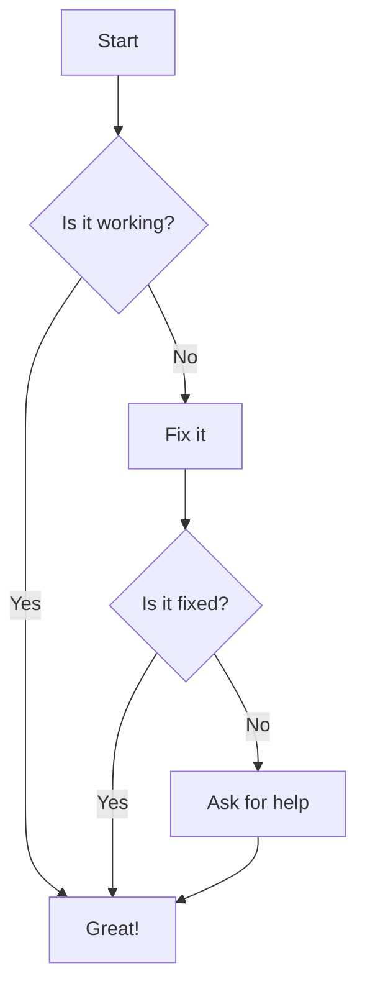

# mermaid-flow-demo



```
graph TD
  Start --> Boil[Boil Water]
  Boil --> AddCoffee[Add Coffee Grounds]
  AddCoffee --> Pour[Pour Hot Water]
  Pour --> Stir[Stir the Coffee]
  Stir --> Enjoy[Enjoy!]
```
